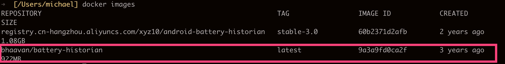
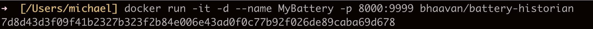

# Mac Docker安装battery-historian


## 环境说明
 ```
 mac os 版本: 10.15.2
 Docker 版本： 2.2.0.0
 ```
 
 1. 如果使用github上的官方安装方法安装，需要vpn，尝试使用vpn，依然没有反应，不知道是不是网络问题，不去纠结。换其他方法。
 2. 使用阿里云上images出现无法打开的bugtrport.zip的问题，如果有大神指导请指教。
 
下面说说我的办法，需要使用一点点vpn（其他方法也是需要的）。
 
## 安装docker环境
 下载文件[Docker dmg](https://docs.docker.com/docker-for-mac/install/) , 回下载一个Docker.dmg文件，直接安装就行。如果在下载文件的过程中需要注册，就注册下。
 可以在本地使用，而不是用云的相关功能。
 
 在官方文档中有详细的方法，按步骤就行。
 
 最后打开终端，check docker 是否安装成功：
 
```bash
[user/home]: docker --version
Docker version 19.03.5, build 633a0ea
```
 
## 安装battery-historian
执行`docker search battery`:

选择一个结果，例如：下载 `docker pull bhaavan/battery-historian` , 此过程需要等待一会，我在使用wifi下载时会出现卡死的情况，换成手机热点就很快下载完成了。

查看一下结果`docker images`:


运行：`docker run -it -d --name MyBattery -p 8000:9999 bhaavan/battery-historian`


此时打开Docker  app的Dashboard可以进行管理，当然也不需要这步，只是下次开机不需要输入那些命令，直接鼠标点击就可以管理

在chrome中输入 ： `http://localhost:8000/`， 注意这里的8000和之间执行`docker run`时指定的命令需要是一样的。界面如下：

不过可能这个界面你无法显示，没有报错，一直是个白色界面，这时需要你打开vpn，可能是需要下载特定的js包，只需要使用这一次，以后就不需要了。

## 参考资料
- [Docker for mac](https://docs.docker.com/docker-for-mac/)
- [battery historian gihub](https://github.com/google/battery-historian)
- [Mac OS使用docker安装ubuntu](https://blog.csdn.net/hjs218/article/details/98470287)