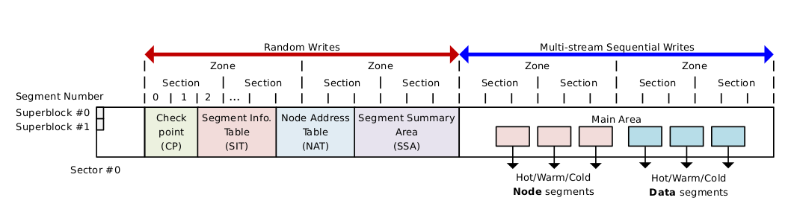

# f2fs笔记

**下载：git clone git://git.kernel.org/pub/scm/linux/kernel/git/jaegeuk/f2fs-tools.git**



整个区域被划分为6大区域： 

- 超级块（SB） 包含基本分区信息和F2FS在格式化分区时确定不可更改的参数
- 检查点（CP） 保存文件系统状态，有效NAT/SIT（见下文说明）集合的位图，孤儿inode列表（文件被删除时尚有引用无法立即释放时需被计入此列表，以便再次挂载时释放）和当前活跃段的所有者信息。和其他日志结构文件系统一样，F2FS检查点时某一给定时点一致的文件系统状态集合——可用于系统崩溃或掉电后的数据恢复。F2FS的两个检查点各占一个Segment，和前述不同的是，F2FS通过检查点头尾两个数据块中的version信息判断检查点是否有效。
- 段信息表Segment Information Table（SIT） 包含主区域（Main Area，见下文说明）中每个段的有效块数和标记块是否有效的位图。SIT主要用于回收过程中选择需要搬移的段和识别段中有效数据。
- 索引节点地址表Node Address Table（NAT） 用于定位所有主区域的索引节点块（包括：inode节点、直接索引节点、间接索引节点）地址。即NAT中存放的是inode或各类索引node的实际存放地址。
- 段摘要区Segment Summary Area (SSA) 主区域所有数据块的所有者信息（即反向索引），包括：父inode号和内部偏移。SSA表项可用于搬移有效块前查找其父亲索引节点编号,
- 主区域 Main Area 由4KB大小的数据块组成，每个块被分配用于存储数据（文件或目录内容）和索引（inode或数据块索引）。一定数量的连续块组成Segment，进而组成Section和Zone（如前所述）。一个Segment要么存储数据，要么存储索引，据此可将Segment划分为数据段和索引段。


F2FS 管理的单元： segment -> section -> zone

## 1 主要的数据结构
### 1.1 基本概念
- block: 4KB对齐且连续的物理存储空间 (闪存内部的基本存储单位是Page（4KB）,N个Page组成一个Block)
- segment: 2M连续的物理存储空间
- session: 若干连续的segment 组成
- zone: 若干连续的zone组成

### 1.2 node
`include/linux/f2fs_fs.h`
node是内部用来定位的。通过下面的数据结构可以看到，f2fs里面的node 主要就是用来记录block的地址。相关的数据结构如下：
```
struct f2fs_node {
    /* can be one of three types: inode, direct, and indirect types */                                                                                                   
    union {
        struct f2fs_inode i;
        struct direct_node dn;
        struct indirect_node in;
    };
    struct node_footer footer;
} __packed;

struct direct_node {
	__le32 addr[ADDRS_PER_BLOCK];	/* array of data block address */
} __packed;

struct indirect_node {
	__le32 nid[NIDS_PER_BLOCK];	/* array of data block address */
} __packed;

```

### 1.3 inode
里面的union可选择其中的f2fs_inode，direct_node，indirect_node之一。
```
struct f2fs_inode {
	__le16 i_mode;			/* file mode */
	__u8 i_advise;			/* file hints */
	__u8 i_inline;			/* file inline flags */
	__le32 i_uid;			/* user ID */
	__le32 i_gid;			/* group ID */
	__le32 i_links;			/* links count */
	__le64 i_size;			/* file size in bytes */
	__le64 i_blocks;		/* file size in blocks */
	__le64 i_atime;			/* access time */
	__le64 i_ctime;			/* change time */
	__le64 i_mtime;			/* modification time */
	__le32 i_atime_nsec;		/* access time in nano scale */
	__le32 i_ctime_nsec;		/* change time in nano scale */
	__le32 i_mtime_nsec;		/* modification time in nano scale */
	__le32 i_generation;		/* file version (for NFS) */
	union {
		__le32 i_current_depth;	/* only for directory depth */
		__le16 i_gc_failures;	/*
					 * # of gc failures on pinned file.
					 * only for regular files.
					 */
	};
	__le32 i_xattr_nid;		/* nid to save xattr */
	__le32 i_flags;			/* file attributes */
	__le32 i_pino;			/* parent inode number */
	__le32 i_namelen;		/* file name length */
	__u8 i_name[F2FS_NAME_LEN];	/* file name for SPOR */
	__u8 i_dir_level;		/* dentry_level for large dir */

	struct f2fs_extent i_ext;	/* caching a largest extent */

	union {
		struct {
			__le16 i_extra_isize;	/* extra inode attribute size */
			__le16 i_inline_xattr_size;	/* inline xattr size, unit: 4 bytes */
			__le32 i_projid;	/* project id */
			__le32 i_inode_checksum;/* inode meta checksum */
			__le64 i_crtime;	/* creation time */
			__le32 i_crtime_nsec;	/* creation time in nano scale */
			__le32 i_extra_end[0];	/* for attribute size calculation */
		} __packed;
		__le32 i_addr[DEF_ADDRS_PER_INODE];	/* Pointers to data blocks */
	};
	__le32 i_nid[DEF_NIDS_PER_INODE];	/* direct(2), indirect(2),
						double_indirect(1) node id */
} __packed;
```
其中上面的i_addr 直接可以指向数据块，如果数据块的数量超过了DEF_NIDS_PER_INODE，就需要使用i_nid。 i_nid 数组可以用来分别指向2个direct、2个indirect、1个double indirect的 block地址索引块。

### 1.4 NAT
上面f2fs_inode数据结构是一个inode块里面的内容。那么这个inode块的地址如何确定呢？这就是f2fs_nat_entry的职责了, 每个f2fs_nat_entry 记录了每个inode编号和其inode块数据地址的对应关系。而专门存储f2fs_nat_entry的block，组成了f2fs_nat_block。
```
struct f2fs_nat_entry {
	__u8 version;		/* latest version of cached nat entry */
	__le32 ino;		/* inode number */
	__le32 block_addr;	/* block address */
} __packed;

struct f2fs_nat_block {
	struct f2fs_nat_entry entries[NAT_ENTRY_PER_BLOCK];
} __packed;
```

### 1.5 f2fs_dir_entry
```
/*
 * space utilization of regular dentry and inline dentry (w/o extra reservation)
 *		regular dentry		inline dentry (def)	inline dentry (min)
 * bitmap	1 * 27 = 27		1 * 23 = 23		1 * 1 = 1
 * reserved	1 * 3 = 3		1 * 7 = 7		1 * 1 = 1
 * dentry	11 * 214 = 2354		11 * 182 = 2002		11 * 2 = 22
 * filename	8 * 214 = 1712		8 * 182 = 1456		8 * 2 = 16
 * total	4096			3488			40
 *
 * Note: there are more reserved space in inline dentry than in regular
 * dentry, when converting inline dentry we should handle this carefully.
 */
#define NR_DENTRY_IN_BLOCK	214	/* the number of dentry in a block */
#define SIZE_OF_DIR_ENTRY	11	/* by byte */
#define SIZE_OF_DENTRY_BITMAP	((NR_DENTRY_IN_BLOCK + BITS_PER_BYTE - 1) / \
					BITS_PER_BYTE)
#define SIZE_OF_RESERVED	(PAGE_SIZE - ((SIZE_OF_DIR_ENTRY + \
				F2FS_SLOT_LEN) * \
				NR_DENTRY_IN_BLOCK + SIZE_OF_DENTRY_BITMAP))
#define MIN_INLINE_DENTRY_SIZE		40	/* just include '.' and '..' entries */

/* One directory entry slot representing F2FS_SLOT_LEN-sized file name */
struct f2fs_dir_entry {
	__le32 hash_code;	/* hash code of file name */
	__le32 ino;		/* inode number */
	__le16 name_len;	/* length of file name */
	__u8 file_type;		/* file type */
} __packed;

/* 4KB-sized directory entry block */
struct f2fs_dentry_block {
	/* validity bitmap for directory entries in each block */
	__u8 dentry_bitmap[SIZE_OF_DENTRY_BITMAP];
	__u8 reserved[SIZE_OF_RESERVED];
	struct f2fs_dir_entry dentry[NR_DENTRY_IN_BLOCK];
	__u8 filename[NR_DENTRY_IN_BLOCK][F2FS_SLOT_LEN];
} __packed;
```
### 1.6 f2fs_super_block
```
struct f2fs_super_block {
	__le32 magic;			/* Magic Number */
	__le16 major_ver;		/* Major Version */
	__le16 minor_ver;		/* Minor Version */
	__le32 log_sectorsize;		/* log2 sector size in bytes */
	__le32 log_sectors_per_block;	/* log2 # of sectors per block */
	__le32 log_blocksize;		/* log2 block size in bytes */
	__le32 log_blocks_per_seg;	/* log2 # of blocks per segment */
	__le32 segs_per_sec;		/* # of segments per section */
	__le32 secs_per_zone;		/* # of sections per zone */
	__le32 checksum_offset;		/* checksum offset inside super block */
	__le64 block_count;		/* total # of user blocks */
	__le32 section_count;		/* total # of sections */
	__le32 segment_count;		/* total # of segments */
	__le32 segment_count_ckpt;	/* # of segments for checkpoint */
	__le32 segment_count_sit;	/* # of segments for SIT */
	__le32 segment_count_nat;	/* # of segments for NAT */
	__le32 segment_count_ssa;	/* # of segments for SSA */
	__le32 segment_count_main;	/* # of segments for main area */
	__le32 segment0_blkaddr;	/* start block address of segment 0 */
	__le32 cp_blkaddr;		/* start block address of checkpoint */
	__le32 sit_blkaddr;		/* start block address of SIT */
	__le32 nat_blkaddr;		/* start block address of NAT */
	__le32 ssa_blkaddr;		/* start block address of SSA */
	__le32 main_blkaddr;		/* start block address of main area */
	__le32 root_ino;		/* root inode number */
	__le32 node_ino;		/* node inode number */
	__le32 meta_ino;		/* meta inode number */
	__u8 uuid[16];			/* 128-bit uuid for volume */
	__le16 volume_name[MAX_VOLUME_NAME];	/* volume name */
	__le32 extension_count;		/* # of extensions below */
	__u8 extension_list[F2FS_MAX_EXTENSION][F2FS_EXTENSION_LEN];/* extension array */
	__le32 cp_payload;
	__u8 version[VERSION_LEN];	/* the kernel version */
	__u8 init_version[VERSION_LEN];	/* the initial kernel version */
	__le32 feature;			/* defined features */
	__u8 encryption_level;		/* versioning level for encryption */
	__u8 encrypt_pw_salt[16];	/* Salt used for string2key algorithm */
	struct f2fs_device devs[MAX_DEVICES];	/* device list */
	__le32 qf_ino[F2FS_MAX_QUOTAS];	/* quota inode numbers */
	__u8 hot_ext_count;		/* # of hot file extension */
	__u8 reserved[310];		/* valid reserved region */
	__le32 crc;			/* checksum of superblock */
} __packed;
```
### 1.7 SIT
SIT （segment info table） 记录在segment里面那些block已经使用。
```
/*
 * Note that f2fs_sit_entry->vblocks has the following bit-field information.
 * [15:10] : allocation type such as CURSEG_XXXX_TYPE
 * [9:0] : valid block count
 */
#define SIT_VBLOCKS_SHIFT	10
#define SIT_VBLOCKS_MASK	((1 << SIT_VBLOCKS_SHIFT) - 1)
#define GET_SIT_VBLOCKS(raw_sit)				\
	(le16_to_cpu((raw_sit)->vblocks) & SIT_VBLOCKS_MASK)
#define GET_SIT_TYPE(raw_sit)					\
	((le16_to_cpu((raw_sit)->vblocks) & ~SIT_VBLOCKS_MASK)	\
	 >> SIT_VBLOCKS_SHIFT)

struct f2fs_sit_entry {
	__le16 vblocks;				/* reference above */
	__u8 valid_map[SIT_VBLOCK_MAP_SIZE];	/* bitmap for valid blocks */
	__le64 mtime;				/* segment age for cleaning */
} __packed;

struct f2fs_sit_block {
	struct f2fs_sit_entry entries[SIT_ENTRY_PER_BLOCK];
} __packed;
```
### 1.8 segment summary
```
struct sit_journal_entry {
	__le32 segno;
	struct f2fs_sit_entry se;
} __packed;

struct sit_journal {
	struct sit_journal_entry entries[SIT_JOURNAL_ENTRIES];
	__u8 reserved[SIT_JOURNAL_RESERVED];
} __packed;

struct nat_journal_entry {
	__le32 nid;
	struct f2fs_nat_entry ne;
} __packed;

struct nat_journal {
	struct nat_journal_entry entries[NAT_JOURNAL_ENTRIES];
	__u8 reserved[NAT_JOURNAL_RESERVED];
} __packed;
```

```

/*
 * For segment summary
 *
 * One summary block contains exactly 512 summary entries, which represents
 * exactly 2MB segment by default. Not allow to change the basic units.
 *
 * NOTE: For initializing fields, you must use set_summary
 *
 * - If data page, nid represents dnode's nid
 * - If node page, nid represents the node page's nid.
 *
 * The ofs_in_node is used by only data page. It represents offset
 * from node's page's beginning to get a data block address.
 * ex) data_blkaddr = (block_t)(nodepage_start_address + ofs_in_node)
 */
#define ENTRIES_IN_SUM		512
#define	SUMMARY_SIZE		(7)	/* sizeof(struct summary) */
#define	SUM_FOOTER_SIZE		(5)	/* sizeof(struct summary_footer) */
#define SUM_ENTRY_SIZE		(SUMMARY_SIZE * ENTRIES_IN_SUM)

/* a summary entry for a 4KB-sized block in a segment */
struct f2fs_summary {
	__le32 nid;		/* parent node id */
	union {
		__u8 reserved[3];
		struct {
			__u8 version;		/* node version number */
			__le16 ofs_in_node;	/* block index in parent node */
		} __packed;
	};
} __packed;

/* summary block type, node or data, is stored to the summary_footer */
#define SUM_TYPE_NODE		(1)
#define SUM_TYPE_DATA		(0)

struct summary_footer {
	unsigned char entry_type;	/* SUM_TYPE_XXX */
	__le32 check_sum;		/* summary checksum */
} __packed;

/* 4KB-sized summary block structure */
struct f2fs_summary_block {
	struct f2fs_summary entries[ENTRIES_IN_SUM];
	struct f2fs_journal journal;
	struct summary_footer footer;
} __packed;
```
### 1.9 
```
-rwxrwxr-x  1 zhangku.guo zhangku.guo   3586 Mar 25 17:03 Kconfig
-rwxrwxr-x  1 zhangku.guo zhangku.guo    367 Mar 25 17:03 Makefile
-rwxrwxr-x  1 zhangku.guo zhangku.guo   9168 Mar 25 17:03 acl.c
-rwxrwxr-x  1 zhangku.guo zhangku.guo   1056 Mar 25 17:03 acl.h
-rwxrwxr-x  1 zhangku.guo zhangku.guo  40409 Mar 25 17:03 checkpoint.c
-rw-rw-r--  1 zhangku.guo zhangku.guo  74403 Apr 18 11:30 data.c
-rwxrwxr-x  1 zhangku.guo zhangku.guo  18836 Mar 25 17:03 debug.c
-rwxrwxr-x  1 zhangku.guo zhangku.guo  23355 Mar 25 17:03 dir.c
-rwxrwxr-x  1 zhangku.guo zhangku.guo  19786 Mar 25 17:03 extent_cache.c
-rw-rw-r--  1 zhangku.guo zhangku.guo 118174 Mar 25 17:03 f2fs.h
-rwxrwxr-x  1 zhangku.guo zhangku.guo  70165 Mar 25 17:03 file.c
-rwxrwxr-x  1 zhangku.guo zhangku.guo  33597 Mar 25 17:03 gc.c
-rwxrwxr-x  1 zhangku.guo zhangku.guo   3007 Mar 25 17:03 gc.h
-rwxrwxr-x  1 zhangku.guo zhangku.guo   2077 Mar 25 17:03 hash.c
-rwxrwxr-x  1 zhangku.guo zhangku.guo  17685 Mar 25 17:03 inline.c
-rwxrwxr-x  1 zhangku.guo zhangku.guo  22264 Mar 25 17:03 inode.c
-rwxrwxr-x  1 zhangku.guo zhangku.guo  29614 Mar 25 17:03 namei.c
-rwxrwxr-x  1 zhangku.guo zhangku.guo  76671 Apr 17 20:56 node.c
-rwxrwxr-x  1 zhangku.guo zhangku.guo  12492 Mar 25 17:03 node.h
-rwxrwxr-x  1 zhangku.guo zhangku.guo  19146 Mar 25 17:03 recovery.c
-rwxrwxr-x  1 zhangku.guo zhangku.guo 115963 Apr 18 13:42 segment.c
-rwxrwxr-x  1 zhangku.guo zhangku.guo  26431 Mar 25 17:03 segment.h
-rwxrwxr-x  1 zhangku.guo zhangku.guo   3203 Mar 25 17:03 shrinker.c
-rw-rw-r--  1 zhangku.guo zhangku.guo  95586 Mar 25 17:03 super.c
-rwxrwxr-x  1 zhangku.guo zhangku.guo  21490 Mar 25 17:03 sysfs.c
-rwxrwxr-x  1 zhangku.guo zhangku.guo   3493 Mar 25 17:03 trace.c
-rwxrwxr-x  1 zhangku.guo zhangku.guo    859 Mar 25 17:03 trace.h
-rwxrwxr-x  1 zhangku.guo zhangku.guo  18091 Apr 17 17:49 xattr.c
-rwxrwxr-x  1 zhangku.guo zhangku.guo   4894 Mar 25 17:03 xattr.h
```

## mount
```
static struct file_system_type f2fs_fs_type = {                                                                                                                          
    .owner      = THIS_MODULE,
    .name       = "f2fs"
    .mount      = f2fs_mount,
    .kill_sb    = kill_f2fs_super,
    .fs_flags   = FS_REQUIRES_DEV,
};
MODULE_ALIAS_FS("f2fs");
```

```
static struct dentry *f2fs_mount(struct file_system_type *fs_type, int flags,
            const char *dev_name, void *data)
{
    return mount_bdev(fs_type, flags, dev_name, data, f2fs_fill_super);
}
```

f2fs_mount -> mount_bdev -> f2fs_fill_super -> f2fs_build_segment_manager
f2fs管理的最小单元是segment，管理segment是其重要工作之一。

## 冷热分离
f2fs对数据进行了简单的冷热分离
```
/*
 * For SIT manager
 *
 * By default, there are 6 active log areas across the whole main area.
 * When considering hot and cold data separation to reduce cleaning overhead,
 * we split 3 for data logs and 3 for node logs as hot, warm, and cold types,
 * respectively.
 * In the current design, you should not change the numbers intentionally.
 * Instead, as a mount option such as active_logs=x, you can use 2, 4, and 6
 * logs individually according to the underlying devices. (default: 6)
 * Just in case, on-disk layout covers maximum 16 logs that consist of 8 for
 * data and 8 for node logs.
 */
#define	NR_CURSEG_DATA_TYPE	(3)
#define NR_CURSEG_NODE_TYPE	(3)
#define NR_CURSEG_TYPE	(NR_CURSEG_DATA_TYPE + NR_CURSEG_NODE_TYPE)

enum {
	CURSEG_HOT_DATA	= 0,	/* directory entry blocks */
	CURSEG_WARM_DATA,	/* data blocks */
	CURSEG_COLD_DATA,	/* multimedia or GCed data blocks */
	CURSEG_HOT_NODE,	/* direct node blocks of directory files */
	CURSEG_WARM_NODE,	/* direct node blocks of normal files */
	CURSEG_COLD_NODE,	/* indirect node blocks */
	NO_CHECK_TYPE,
};
```


