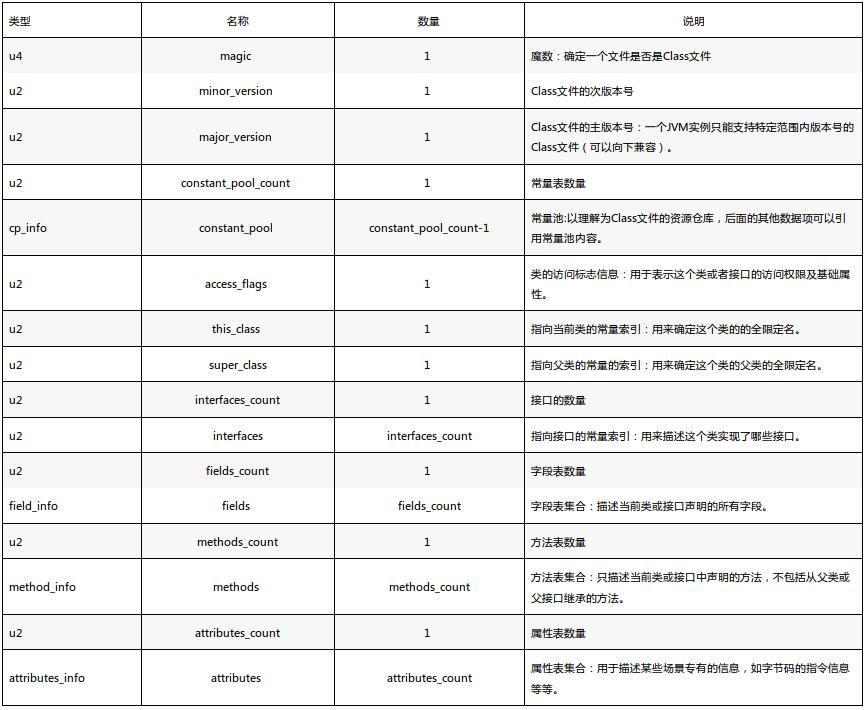
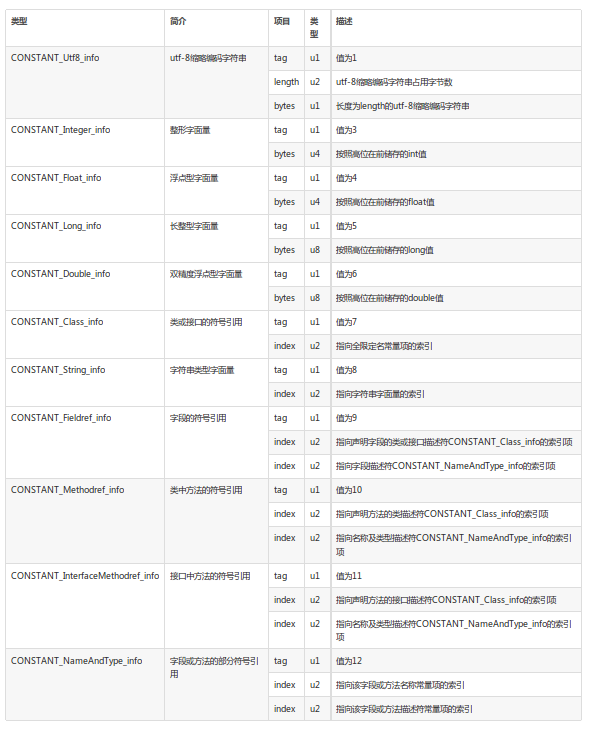
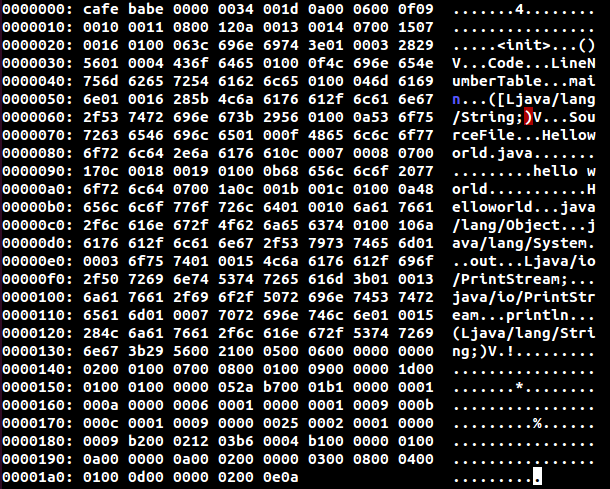
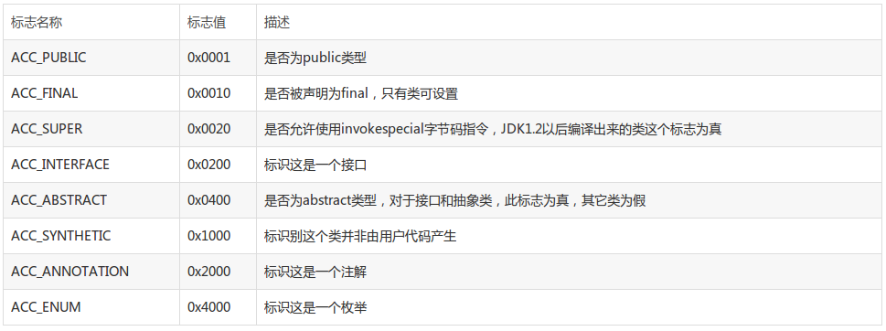
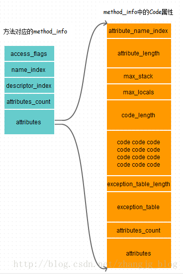
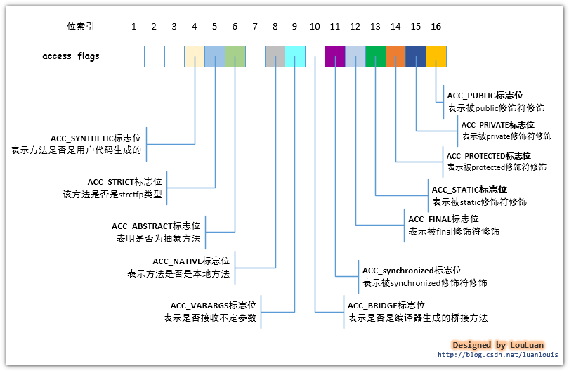

# Class文件解析

# 1 Class 文件结构

```
ClassFile {
       u4 magic;
       u2 minor_version;
       u2 major_version;
       u2 constant_pool_count;
       cp_info constant_pool[constant_pool_count-1];
       u2 access_flags;
       u2 this_class;
       u2 super_class;
       u2 interfaces_count;
       u2 interfaces[interfaces_count];
       u2 fields_count;
       field_info fields[fields_count];
       u2 methods_count;
       method_info methods[methods_count];
       u2 attributes_count;
       attribute_info attributes[attributes_count];
}
```

u1、u2、u4 分别表示1个字节，2个字节和4个字节。



`constant_pool`有具体的数据结构规范:



ASCII表:


# 2 实例分析

分析的java文件(Helloworld.java):

```
public class Helloworld{
    public static void main(String[] args) {
        System.out.println("hello world");
    }
}
```

执行`javac Helloworld.java`, 生成Helloworld.class文件

使用vim打开class文件, 输入`:%!xxd`查看HEX文件:



使用`javap -verbose Helloworld.class`,解析出信息: 

```
Classfile /data/nishome/tdsw1/qiang.li/Helloworld.class
  Last modified 2019-4-24; size 425 bytes
  MD5 checksum f92a9438ead8ad4ecc3fc01d3b2cec82
  Compiled from "Helloworld.java"
public class Helloworld
  minor version: 0
  major version: 52
  flags: ACC_PUBLIC, ACC_SUPER
Constant pool:
   #1 = Methodref          #6.#15         // java/lang/Object."<init>":()V
   #2 = Fieldref           #16.#17        // java/lang/System.out:Ljava/io/PrintStream;
   #3 = String             #18            // hello world
   #4 = Methodref          #19.#20        // java/io/PrintStream.println:(Ljava/lang/String;)V
   #5 = Class              #21            // Helloworld
   #6 = Class              #22            // java/lang/Object
   #7 = Utf8               <init>
   #8 = Utf8               ()V
   #9 = Utf8               Code
  #10 = Utf8               LineNumberTable
  #11 = Utf8               main
  #12 = Utf8               ([Ljava/lang/String;)V
  #13 = Utf8               SourceFile
  #14 = Utf8               Helloworld.java
  #15 = NameAndType        #7:#8          // "<init>":()V
  #16 = Class              #23            // java/lang/System
  #17 = NameAndType        #24:#25        // out:Ljava/io/PrintStream;
  #18 = Utf8               hello world
  #19 = Class              #26            // java/io/PrintStream
  #20 = NameAndType        #27:#28        // println:(Ljava/lang/String;)V
  #21 = Utf8               Helloworld
  #22 = Utf8               java/lang/Object
  #23 = Utf8               java/lang/System
  #24 = Utf8               out
  #25 = Utf8               Ljava/io/PrintStream;
  #26 = Utf8               java/io/PrintStream
  #27 = Utf8               println
  #28 = Utf8               (Ljava/lang/String;)V
{
  public Helloworld();
    descriptor: ()V
    flags: ACC_PUBLIC
    Code:
      stack=1, locals=1, args_size=1
         0: aload_0
         1: invokespecial #1                  // Method java/lang/Object."<init>":()V
         4: return
      LineNumberTable:
        line 1: 0

  public static void main(java.lang.String[]);
    descriptor: ([Ljava/lang/String;)V
    flags: ACC_PUBLIC, ACC_STATIC
    Code:
      stack=2, locals=1, args_size=1
         0: getstatic     #2                  // Field java/lang/System.out:Ljava/io/PrintStream;
         3: ldc           #3                  // String hello world
         5: invokevirtual #4                  // Method java/io/PrintStream.println:(Ljava/lang/String;)V
         8: return
      LineNumberTable:
        line 3: 0
        line 4: 8
}
SourceFile: "Helloworld.java"
```

接下来的分析就是就将HEX和javap解析出来的文件进行比对,学习class文件的构成.

```
cafe babe : magic 魔数
0000 : minor_version 次版本
0034 : major_version 主版本 52 对应的是 J2SE 8
001d : constant_pool_count   //

constant pool(共有001d-1个):
// 常量项的类型tag 是u1 大小,只占8bit (一个byte)
#1  0a00 0600 0f :
    0a: Methodref  (CONSTANT_Methodref  tag: 10  -> 0x0a)
    00 0600 0f: #6.#15  (#6/#15 代表的是索引)

#2  09 0010 0011 :
    09: Fieldref (CONSTANT_Fieldref tag:9 -> 0x09)
    0010 0011: #16.#17  (索引)

#3  0800 12 :
    08: String (CONSTANT_String tag : 8 -> 0x08)
    00 12: #18 (索引)

#4  0a 0013 0014:
    0a: Methodref  (CONSTANT_Methodref  tag: 10  -> 0x0a)
    0013 0014 : #19.#20 (索引)

#5  0700 15:
    07 : Class (CONSTANT_Class tag:7 -> 0x07)
    00 15: #21 (索引)

#6  07 0016:
    07 : Class (CONSTANT_Class tag:7 -> 0x07)
    0016 : #22 (索引)

#7  0100 063c 696e 6974 3e:
    01 : Utf8 (CONSTANT_Utf8 tag: 1 -> 0x01)
    00 06: 长度,说明该utf8后面有6字符
    3c 69 6e 69 74 3e : 依据ASCII 对应: <init>
    <  i  n  i  t  >

#8  01 0003 2829 56:
    01 : Utf8 (CONSTANT_Utf8 tag: 1 -> 0x01)
    0003 : 长度 3
    28 29 56: 依据ASCII 对应: ()V  (V 代表void)
    (  )  V

#9  01 0004 436f 6465:
    01 : Utf8 (CONSTANT_Utf8 tag: 1 -> 0x01)
    0004 : 长度 4
    43 6f 64 65 : 依据ASCII 对应: Code
    C  o  d  e

#10 0100 0f4c 696e 654e 756d 6265 7254 6162 6c65:
    01 : Utf8 (CONSTANT_Utf8 tag: 1 -> 0x01)
    00 0f : 长度 15
    4c 69 6e 65 4e 75 6d 62 65 72 54 61 62 6c 65 : LineNumberTable 共15字符
    L  i  n  e  N  u  m  b  e  r  T  a  b  l  e

#11 0100 046d 6169 6e:
    01 : Utf8 (CONSTANT_Utf8 tag: 1 -> 0x01)
    00 04 : 长度 4
    6d 61 69 6e : main
    m  a  i  n

#12 01 0016 285b 4c6a 6176 612f 6c61 6e67 2f53 7472 696e 673b 2956:
    01 : Utf8 (CONSTANT_Utf8 tag: 1 -> 0x01)
    0016 : 长度 22
    28 5b 4c 6a 61 76 61 2f 6c 61 6e 67 2f 53 74 72 69 6e 67 3b 29 56: 22个字符
    (  [  L  j  a  v  a  /  l  a  n  g  /  S  t  r  i  n  g  ;  )  V

#13 0100 0a53 6f75 7263 6546 696c 65:
    01 : Utf8 (CONSTANT_Utf8 tag: 1 -> 0x01)
    00 0a : 长度 10
    53 6f 75 72 63 65 46 69 6c 65 : SourceFile 共10字符
    S  o  u  r  c  e  F  i  l  e

#14 01 000f 4865 6c6c 6f77 6f72 6c64 2e6a 6176 61:
    01 : Utf8 (CONSTANT_Utf8 tag: 1 -> 0x01)
    000f : 长度 15
    48 65 6c 6c 6f 77 6f 72 6c 64 2e 6a 61 76 61 : Helloworld.java 共15字符
    H  e  l  l  o  w  o  r  l  d  .  j  a  v  a

#15 0c 0007 0008:
    0c : NameAndType (CONSTANT_NameAndType_info tag 12 -> 0x0c)
    0007 0008 : 索引,指向  #7 #8 (也就是 init ()V)

#16 0700 17 :
    07 : Class (CONSTANT_Class tag:7 -> 0x07)
    00 17 : 索引,指向 #23

#17 0c 0018 0019:
    0c : NameAndType (CONSTANT_NameAndType_info tag 12 -> 0x0c)
    0018 0019 : 索引,指向 #24 #25

#18 0100 0b68 656c 6c6f 2077 6f72 6c64:
    01 : Utf8 (CONSTANT_Utf8 tag: 1 -> 0x01)
    00 0b : 长度 11
    68 65 6c 6c 6f 20 77 6f 72 6c 64 : hello world
    h  e  l  l  o     w  o  r  l  d

#19 0700 1a:
    07 : Class (CONSTANT_Class tag:7 -> 0x07)
    00 1a : 索引,指向 #26

#20 0c 001b 001c:
    0c : NameAndType (CONSTANT_NameAndType_info tag 12 -> 0x0c)
    001b 001c : 索引,指向 #27 #28

#21 0100 0a48 656c 6c6f 776f 726c 64:
    01 : Utf8 (CONSTANT_Utf8 tag: 1 -> 0x01)
    00 0a : 长度 10
    48 65 6c 6c 6f 77 6f 72 6c 64 :Helloworld
    H  e  l  l  o  w  o  r  l  d

#22 01 0010 6a61 7661 2f6c 616e 672f 4f62 6a65 6374:
    01 : Utf8 (CONSTANT_Utf8 tag: 1 -> 0x01)
    0010 :长度 16
    6a 61 76 61 2f 6c 61 6e 67 2f 4f 62 6a 65 63 74 : java/lang/Object
    j  a  v  a  /  l  a  n  g  /  O  b  j  e  c  t

#23 0100 106a 6176 612f 6c61 6e67 2f53 7973 7465 6d :
    01 : Utf8 (CONSTANT_Utf8 tag: 1 -> 0x01)
    00 10 : 长度 16
    6a 61 76 61 2f 6c 61 6e 67 2f 53 79 73 74 65 6d:
    j  a  v  a  /  l  a  n  g  /  S  y  s  t  e  m

#24 01 0003 6f75 74:
    01 : Utf8 (CONSTANT_Utf8 tag: 1 -> 0x01)
    0003 : 长度 3
    6f 75 74 : out
    o  u  t

#25 01 0015 4c6a 6176 612f 696f 2f50 7269 6e74 5374 7265 616d 3b :
    01 : Utf8 (CONSTANT_Utf8 tag: 1 -> 0x01)
    0015 : 长度 21
    4c 6a 61 76 61 2f 69 6f 2f 50 72 69 6e 74 53 74 72 65 61 6d 3b
    L  j  a  v  a  /  i  o  /  P  r  i  n  t  S  t  r  e  a  m  ;

#26 01 0013 6a61 7661 2f69 6f2f 5072 696e 7453 7472 6561 6d :
    01 : Utf8 (CONSTANT_Utf8 tag: 1 -> 0x01)
    0013 : 长度 19
    6a 61 76 61 2f 69 6f 2f 50 72 69 6e 74 53 74 72 65 61 6d :
    j  a  v  a  /  i  o  /  P  r  i  n  t  S  t  r  e  a  m

#27 01 0007 7072 696e 746c 6e :
    01 : Utf8 (CONSTANT_Utf8 tag: 1 -> 0x01)
    0007 : 长度 7
    70 72 69 6e 74 6c 6e : println
    p  r  i  n  t  l  n

#28 01 0015 284c 6a61 7661 2f6c 616e 672f 5374 7269 6e67 3b29 56 :
    01 : Utf8 (CONSTANT_Utf8 tag: 1 -> 0x01)
    0015 : 长度 21
    28 4c 6a 61 76 61 2f 6c 61 6e 67 2f 53 74 72 69 6e 67 3b 29 56 : 21个字符
    (  L  j  a  v  a  /  l  a  n  g  /  S  t  r  i  n  g  ;  )  V
```

constant_pool_count 是 29 , 所以常量池有29 - 1 个.到这里常量池,分析完毕.依据class文件
结构,接下来就是

```
u2 access_flags;
u2 this_class;
u2 super_class;
u2 interfaces_count;
u2 interfaces[interfaces_count];
u2 fields_count;
field_info fields[fields_count];
u2 methods_count;
method_info methods[methods_count];
u2 attributes_count;
attribute_info attributes[attributes_count];
```

类的访问标示:



接着分析class文件
```
00 21 : access_flags (因为 access_flags是u2的) ACC_PUBLIC(0x0001), ACC_SUPER(0x0020)
00 05 : #5 索引,最后指向HelloWorld
00 06 : #6 索引,最后指向 java/lang/Object
00 00 : 0 interfaces_count 是0
00 00 : fields_count 为 0
00 02 : methods_count 方法数为2
```

分析method_info前,先分析下器结构:



每个methon就对应一个methon info. 参考: [method_info详解](https://blog.csdn.net/zhangjg_blog/article/details/22432599)

```
method_info {
u2 access_flags;
u2 name_index;
u2 descriptor_index;
u2 attributes_count;
attribute_info attributes[attributes_count];
}
```

关于 access_flag: 



```
method_info methods[methods_count] :
00 0100 0700 0800 01 :
    00 01 : ACC_PUBLIC  (access_flags)
    00 07 : 索引 #7 (name_index) 值: <init>
    00 08 : 索引 #8 (descriptor_index) 值: ()V
    00 01 : attributes_count 属性数量为 1   这个属性就是code属性
```

code属性结构:

```
//Code 属性的结构
Code_attribute {
    u2 attribute_name_index; //对应一个`CONSTANT_Utf8_info `索引，内容是Code
    u4 attribute_length;
    u2 max_stack; //operand stack 操作数栈的最大深度
    u2 max_locals;//局部变量数组的长度
    u4 code_length; //长度小于65536
    u1 code[code_length];//字节码指令
    u2 exception_table_length;
    {   u2 start_pc;
        u2 end_pc; //在code数组中的起点和终点[start_pa, end_pc)
        u2 handler_pc; //异常处理对应的字节码起始位置
        u2 catch_type;// 是常量池中 CONSTANT_Class_info的索引，表示捕获的异常类型，为0则处理任何异常 
    } exception_table[exception_table_length];//异常表
    u2 attributes_count;
    attribute_info attributes[attributes_count];
}
```

```
00 0900 0000 1d00 0100 0100 0000 052a b700 01b1 :
    0009 : 索引 #9 值: Code
    00 0000 1d : attribute_length 值: 29
    00 01 : max_stack = 1
    00 01 : max_locals = 1
    00 0000 05 : code_length = 5
    2a b700 01b1 : code (因为code_length是5,一个code是一个u1)
```

java 虚拟机指令集参考: [维基百科java指令集列表](https://en.wikipedia.org/wiki/Talk:Java_bytecode_instruction_listings)

将面的code码, 进行解析: 

```
2a b700 01b1 :
0x2a : aload_0 将第0个引用类型本地变量推送至栈顶
0xb7 : invokespecial 调用超类构造方法，实例初始化方法，私有方法
0x00 : nop 什么都不做
0x01 : aconst_null 将null推送至栈顶
0xb1 : return 从当前方法返回void
```

接着分析Code_attribute文件:

```
0000 : exception_table_length = 0
0001 : attributes_count = 1
```

Code的属性可以是: LineNumberTable,LocalVariableTable,LocalVariableTypeTable,StackMapTable(§4.7.4)
不同的属性,结构也不同.

```
000a : 索引(attribute_name_index) #10 值: LineNumberTable
```

这里Code的唯一一个属性是LineNumberTable属性,接着看LineNumberTable属性(用于debug)的结构:

```
LineNumberTable_attribute {
u2 attribute_name_index;
u4 attribute_length;
u2 line_number_table_length;
{
u2 start_pc;
u2 line_number;
} line_number_table[line_number_table_length];
}
```

```
0000 0006 : attribute_length = 6
0001 : line_number_table_length = 1
0000 : start_pc = 0
0001 : line_number = 1
```

到这`attribute_info attributes[attributes_count];` 就分析完了,也就是第一个method分析完了.methods_count = 2,
所以接下来还有一个method_info结构.

```
0009 : access_flags = 9 是ACC_STATIC(0x0008) + ACC_PUBLIC(0x0001)
000b : name_index 索引 #11 值: main
000c : descriptor_index 索引 #12 值: ([Ljava/lang/String;)V
0001 : attributes_count = 1
0009 : attribute_name_index 索引 #9 值: Code
0000 0025 : attribute_length = 37
0002 : max_stack = 2
0001 : max_locals = 1
0000 0009 : code_length = 9
b200 0212 03b6 0004 b1 : code 码
b2 : getstatic 	获取指定类的静态域，并将其值压入栈顶
00 : nop 	什么都不做
02 : iconst_m1 	将int型-1推送至栈顶
12 : ldc 	将int, float或String型常量值从常量池中推送至栈顶
03 : iconst_0 	将int型0推送至栈顶
b6 : invokevirtual 调用实例方法
00 : nop 	什么都不做
04 : iconst_1 	将int型1推送至栈顶
b1 : return 	从当前方法返回void

00 00 : exception_table_length = 0
00 01 : attributes_count = 1
00 0a : attribute_name_index 索引 #10 值: LineNumberTable

LineNumberTable_attribute {
u2 attribute_name_index;
u4 attribute_length;
u2 line_number_table_length;
{
u2 start_pc;
u2 line_number;
} line_number_table[line_number_table_length];
}

00 0000 0a00 0200 0000 0300 0800 0400
0100 0d00 0000 0200 0e0a

00 0000 0a : attribute_length = 10 属性长度 这里就是 00 02 00 00 00 03 00 08 00 04
00 02 : line_number_table_length = 2
00 00 : start_pc = 0 code 码里面的第0条
00 03 : line_number = 3 对应源代码的行号
00 08 : start_pc = 8
00 04 : line_number = 4
```

到这class文件的`method_info methods[methods_count];`已经分析完毕.

接下在分析

```
       u2 attributes_count;
       attribute_info attributes[attributes_count];
```

对应的class `00 0100 0d00 0000 0200 0e0a`

```
00 01 : attributes_count = 1
00 0d : attribute_name_index 索引, #13 值: SourceFile

SourceFile 属性的结构:

SourceFile_attribute {
u2 attribute_name_index;
u4 attribute_length;
u2 sourcefile_index;
}

00 0000 02 : attribute_length = 2
00 0e : sourcefile_index 索引 #14 值: Helloworld.java
```

最后的 `0a` 是%!xxd 命令导致的,可以使用其他命令, [参考](https://blog.csdn.net/qqliyunpeng/article/details/50548274)


