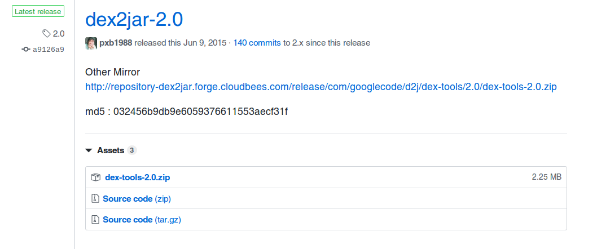
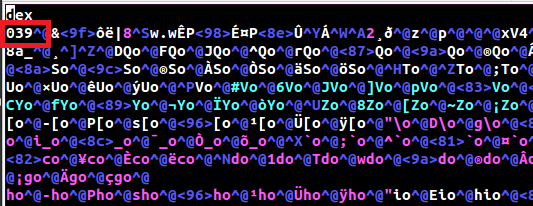
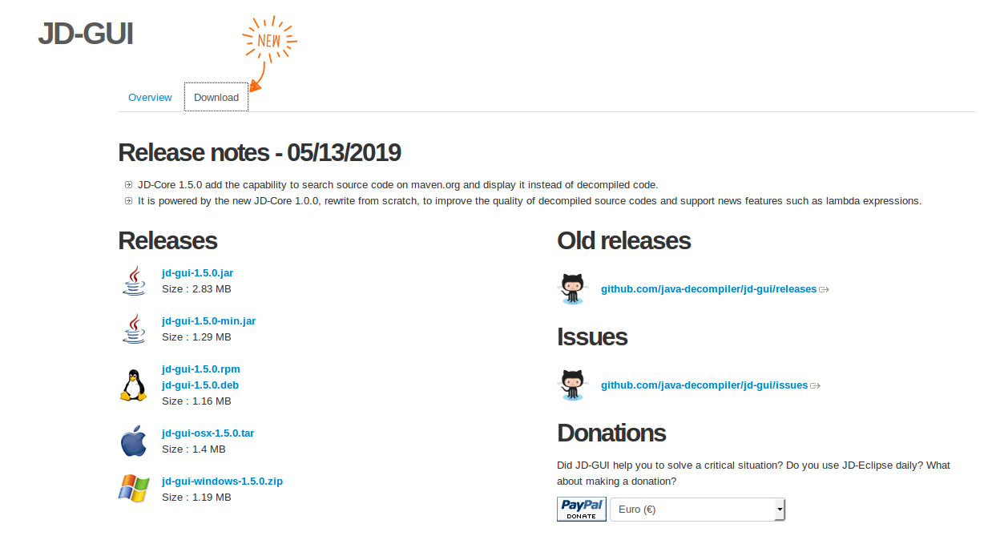
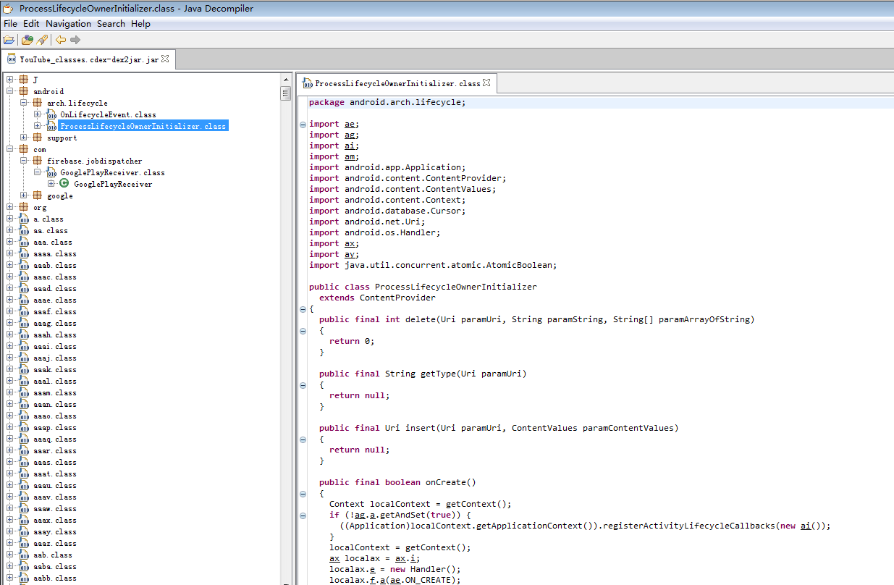

# Android P 反编译vdex

本文记一次解析YouTube的vdex的过程.由于在Android P中有一种新的dex文件格式cdex,

## 0 准备文件
从机器中拷贝出文件:

```
adb pull system/app/YouTube ./
```

目录结构如下:

```
YouTube |
        |--YouTube.apk
        |--oat/arm
                  |--YouTube.odex
                  |--YouTube.vdex       
```
本例子中,要解析的文件就是`YouTube.vdex`.

**在以下解析过程中,如果提示权限问题,请自行使用`chmod`添加可执行权限，下文中不在赘述！！！**

## 1 解析vdex到cdex文件

需要用到一个开源工具[vdexExtractor](https://github.com/anestisb/vdexExtractor),

```
git clone https://github.com/anestisb/vdexExtractor.git
```
执行`vdexExtractor/make.sh`, 就会在产生`vdexExtractor/bin/vdexExtractor`.
使用bin文件`vdexExtractor`解析vdex文件:

```
./vdexExtractor -i ./YouTube.vdex -o ./ --deps -f
```
> 此处将vdex文件和vdexExtractor放到同一目录下

解析完成后会得到4个cdex文件:`YouTube_classes.cdex`,`YouTube_classes2.cdex`,`YouTube_classes3.cdex`,`YouTube_classes4.cdex`.

> vdexExtractor 的详细使用,可以使用`./vdexExtractor -h` 查看.

## 2 解析cdex到dex文件
解析cdex到需要用到[compact_dex_converter](https://github.com/anestisb/vdexExtractor/issues/23),在网页中下载`compact_dex_converter_linux.zip`
可以在ubuntu下使用.

使用`compact_dex_converter`,解析
```
./compact_dex_converter YouTube_classes.cdex
```
> 四个cdex文件我们以YouTube_classes.cdex为例

运行完会产生一个`YouTube_classes.cdex.new`文件，该文件就是我们的dex文件。我们可以用vim打开改文件，文件的开头就是dex文件的格式。

使用`xxd`命令将`YouTube_classes.cdex.new`转换成十六进制的文件

```
xxd YouTube_classes.cdex.new > YouTube_classes.xxd
```
使用vim 打开十六进制文件:
```
0000000: 6465 780a 3033 3900 269f f4eb 7c38 1377  dex.039.&...|8.w
0000010: 2e77 ca50 98c9 a450 8edb 19c1 1701 32b8  .w.P...P......2.
0000020: f000 7a00 7000 0000 7856 3412 0000 0000  ..z.p...xV4.....
0000030: 0000 0000 1400 7a00 1496 0000 7000 0000  ......z.....p...
0000040: 1c49 0000 c058 0200 6533 0000 307d 0300  .I...X..e3..0}..
0000050: d3c4 0000 ece5 0500 f6ff 0000 840c 0c00  ................
0000060: 8c30 0000 340c 1400 38e3 5f00 b81d 1a00  .0..4...8._.....
0000070: 4451 6f00 4651 6f00 4a51 6f00 5e51 6f00  DQo.FQo.JQo.^Qo.
0000080: 7251 6f00 8751 6f00 9a51 6f00 ae51 6f00  rQo..Qo..Qo..Qo.
0000090: c251 6f00 d851 6f00 ee51 6f00 0452 6f00  .Qo..Qo..Qo..Ro.
00000a0: 1a52 6f00 3052 6f00 4752 6f00 5d52 6f00  .Ro.0Ro.GRo.]Ro.
00000b0: 7152 6f00 8652 6f00 9e52 6f00 b652 6f00  qRo..Ro..Ro..Ro.
```
> 这里只是显示了开头的部分

熟悉dex文件结构的你可能一眼就看出这个是dex文件了.

## 3 解析dex到jar
解析dex文件到jar文件需要用到[dex2jar](https://github.com/pxb1988/dex2jar/releases).
找到`Latest release`,进行下载.



查看工具的内容:
```
d2j-baksmali.bat  d2j-dex2jar.sh     d2j-dex-recompute-checksum.bat  d2j_invoke.sh    d2j-jar2jasmin.bat  d2j-jasmin2jar.sh  d2j-std-apk.bat
d2j-baksmali.sh   d2j-dex2smali.bat  d2j-dex-recompute-checksum.sh   d2j-jar2dex.bat  d2j-jar2jasmin.sh   d2j-smali.bat      d2j-std-apk.sh
d2j-dex2jar.bat   d2j-dex2smali.sh   d2j_invoke.bat                  d2j-jar2dex.sh   d2j-jasmin2jar.bat  d2j-smali.sh       lib
```

可以看到工具里面既有sh文件,也有bat文件,该工具适用于Linux & Windows.这里使用shell版本.`./dex2jar-2.0/d2j-dex2jar.sh YouTube_classes.cdex.new`
```
dex2jar YouTube_classes.cdex.new -> ./YouTube_classes.cdex-dex2jar.jar
com.googlecode.d2j.DexException: not support version.
	at com.googlecode.d2j.reader.DexFileReader.<init>(DexFileReader.java:151)
	at com.googlecode.d2j.reader.DexFileReader.<init>(DexFileReader.java:211)
	at com.googlecode.dex2jar.tools.Dex2jarCmd.doCommandLine(Dex2jarCmd.java:104)
	at com.googlecode.dex2jar.tools.BaseCmd.doMain(BaseCmd.java:288)
	at com.googlecode.dex2jar.tools.Dex2jarCmd.main(Dex2jarCmd.java:32)
```

这里如果遇到版本报错, 是由于dex文件版本导致的,可以用vim打开`YouTube_classes.cdex.new`,将第二行的开头的`039`改成`036`.



再执行`./dex2jar-2.0/d2j-dex2jar.sh YouTube_classes.cdex.new`即可.会产生文件`YouTube_classes.cdex-dex2jar.jar`.
这就是我们需要的jar文件.

## 4 解析jar文件
查看jar文件使用[JD-GUI](!http://jd.benow.ca/)



> 现在所需版本即可.

启动`jd-gui`,打开刚刚解析好的jar文件即可.



## 参看文献
- [JD-GUI官网](http://java-decompiler.github.io/)
- [vdexExtractor官方仓库](https://github.com/anestisb/vdexExtractor)
- [compact_dex_converter社区贡献](https://github.com/anestisb/vdexExtractor/issues/23)


