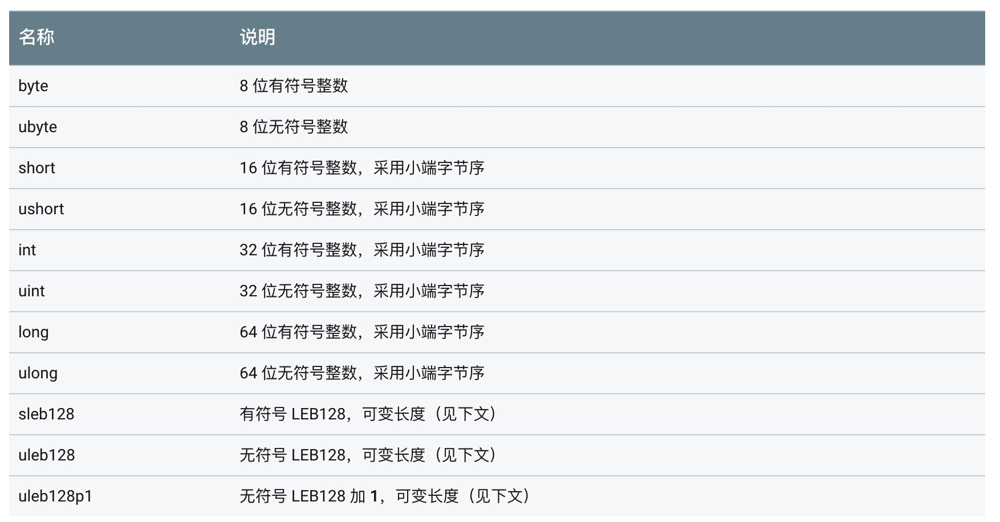

# dex 文件解析

dex文件是android特有的文件,对应java里面的class,更加适合ARM架构.本文的重点是解析一个dex文件.

## 0 工具介绍
分析dex的过程会用到两个bin文件,在Sdk里面

```
Android/Sdk/build-tools/28.0.3/dx
Android/Sdk/build-tools/28.0.3/dexdump
```
28.0.3是版本号。

`dx`用于生成dex文件,`dexdump`用于解析`dex`文件,类似与解析`class`文件的`javap`

`dx`,`dexdump `的源码位于

```
aosp/dalvik/dx
aosp/dalvik/dexdump
```
## 1 实例介绍

java文件:HelloWorld.java

```
public class HelloWorld {
    public static void main(String[] args) {
        System.out.println("Hello, World!");
    }
}
```
通过运行`javac HelloWorld.java` ,产生 `HelloWorld.class`,接着运行`dx --dex --output=HelloWorld.dex HelloWorld.class`
产生dex文件`HelloWorld.dex`.

使用`xxd`命令可以以十六进制的形式查看dex文件, `xxd HelloWorld.dex` : 

```
0000000: 6465 780a 3033 3500 1561 511c 0915 68b5  dex.035..aQ...h.
0000010: ded9 ceb5 e673 40d2 14d2 3c20 185e abad  .....s@...< .^..
0000020: ec02 0000 7000 0000 7856 3412 0000 0000  ....p...xV4.....
0000030: 0000 0000 4c02 0000 0e00 0000 7000 0000  ....L.......p...
0000040: 0700 0000 a800 0000 0300 0000 c400 0000  ................
0000050: 0100 0000 e800 0000 0400 0000 f000 0000  ................
0000060: 0100 0000 1001 0000 bc01 0000 3001 0000  ............0...
0000070: 7601 0000 7e01 0000 8d01 0000 9e01 0000  v...~...........
0000080: ac01 0000 c301 0000 d701 0000 eb01 0000  ................
0000090: ff01 0000 0202 0000 0602 0000 1b02 0000  ................
00000a0: 2102 0000 2602 0000 0300 0000 0400 0000  !...&...........
00000b0: 0500 0000 0600 0000 0700 0000 0800 0000  ................
00000c0: 0a00 0000 0800 0000 0500 0000 0000 0000  ................
00000d0: 0900 0000 0500 0000 6801 0000 0900 0000  ........h.......
00000e0: 0500 0000 7001 0000 0400 0100 0c00 0000  ....p...........
00000f0: 0000 0000 0000 0000 0000 0200 0b00 0000  ................
0000100: 0100 0100 0d00 0000 0200 0000 0000 0000  ................
0000110: 0000 0000 0100 0000 0200 0000 0000 0000  ................
0000120: 0200 0000 0000 0000 3b02 0000 0000 0000  ........;.......
0000130: 0100 0100 0100 0000 2f02 0000 0400 0000  ......../.......
0000140: 7010 0300 0000 0e00 0300 0100 0200 0000  p...............
0000150: 3402 0000 0800 0000 6200 0000 1a01 0100  4.......b.......
0000160: 6e20 0200 1000 0e00 0100 0000 0300 0000  n ..............
0000170: 0100 0000 0600 063c 696e 6974 3e00 0d48  .......<init>..H
0000180: 656c 6c6f 2c20 576f 726c 6421 000f 4865  ello, World!..He
0000190: 6c6c 6f57 6f72 6c64 2e6a 6176 6100 0c4c  lloWorld.java..L
00001a0: 4865 6c6c 6f57 6f72 6c64 3b00 154c 6a61  HelloWorld;..Lja
00001b0: 7661 2f69 6f2f 5072 696e 7453 7472 6561  va/io/PrintStrea
00001c0: 6d3b 0012 4c6a 6176 612f 6c61 6e67 2f4f  m;..Ljava/lang/O
00001d0: 626a 6563 743b 0012 4c6a 6176 612f 6c61  bject;..Ljava/la
00001e0: 6e67 2f53 7472 696e 673b 0012 4c6a 6176  ng/String;..Ljav
00001f0: 612f 6c61 6e67 2f53 7973 7465 6d3b 0001  a/lang/System;..
0000200: 5600 0256 4c00 135b 4c6a 6176 612f 6c61  V..VL..[Ljava/la
0000210: 6e67 2f53 7472 696e 673b 0004 6d61 696e  ng/String;..main
0000220: 0003 6f75 7400 0770 7269 6e74 6c6e 0001  ..out..println..
0000230: 0007 0e00 0301 0007 0e78 0000 0002 0000  .........x......
0000240: 8180 04b0 0201 09c8 0200 0000 0d00 0000  ................
0000250: 0000 0000 0100 0000 0000 0000 0100 0000  ................
0000260: 0e00 0000 7000 0000 0200 0000 0700 0000  ....p...........
0000270: a800 0000 0300 0000 0300 0000 c400 0000  ................
0000280: 0400 0000 0100 0000 e800 0000 0500 0000  ................
0000290: 0400 0000 f000 0000 0600 0000 0100 0000  ................
00002a0: 1001 0000 0120 0000 0200 0000 3001 0000  ..... ......0...
00002b0: 0110 0000 0200 0000 6801 0000 0220 0000  ........h.... ..
00002c0: 0e00 0000 7601 0000 0320 0000 0200 0000  ....v.... ......
00002d0: 2f02 0000 0020 0000 0100 0000 3b02 0000  /.... ......;...
00002e0: 0010 0000 0100 0000 4c02 0000            ........L...
```

利用dexdump解析dex文件`dexdump HelloWorld.dex`: 

```
Processing 'HelloWorld.dex'...
Opened 'HelloWorld.dex', DEX version '035'
DEX file header:
magic               : 'dex\n035\0'
checksum            : 1c516115
signature           : 0915...abad
file_size           : 748
header_size         : 112
link_size           : 0
link_off            : 0 (0x000000)
string_ids_size     : 14
string_ids_off      : 112 (0x000070)
type_ids_size       : 7
type_ids_off        : 168 (0x0000a8)
proto_ids_size       : 3
proto_ids_off        : 196 (0x0000c4)
field_ids_size      : 1
field_ids_off       : 232 (0x0000e8)
method_ids_size     : 4
method_ids_off      : 240 (0x0000f0)
class_defs_size     : 1
class_defs_off      : 272 (0x000110)
data_size           : 444
data_off            : 304 (0x000130)

Class #0            -
  Class descriptor  : 'LHelloWorld;'
  Access flags      : 0x0001 (PUBLIC)
  Superclass        : 'Ljava/lang/Object;'
  Interfaces        -
  Static fields     -
  Instance fields   -
  Direct methods    -
    #0              : (in LHelloWorld;)
      name          : '<init>'
      type          : '()V'
      access        : 0x10001 (PUBLIC CONSTRUCTOR)
      code          -
      registers     : 1
      ins           : 1
      outs          : 1
      insns size    : 4 16-bit code units
      catches       : (none)
      positions     : 
        0x0000 line=1
      locals        : 
        0x0000 - 0x0004 reg=0 this LHelloWorld; 
    #1              : (in LHelloWorld;)
      name          : 'main'
      type          : '([Ljava/lang/String;)V'
      access        : 0x0009 (PUBLIC STATIC)
      code          -
      registers     : 3
      ins           : 1
      outs          : 2
      insns size    : 8 16-bit code units
      catches       : (none)
      positions     : 
        0x0000 line=3
        0x0007 line=4
      locals        : 
  Virtual methods   -
  source_file_idx   : 2 (HelloWorld.java)
```

接下来的内容就是分析将dex内容对应到dexdump解析出来的内容.

## 2 实例分析

dex文件的结构定义在: `dalvik/libdex/DexFile.h`

```
/*
 * Structure representing a DEX file.
 *
 * Code should regard DexFile as opaque, using the API calls provided here
 * to access specific structures.
 */
struct DexFile {
    /* directly-mapped "opt" header */
    const DexOptHeader* pOptHeader;

    /* pointers to directly-mapped structs and arrays in base DEX */
    const DexHeader*    pHeader;
    const DexStringId*  pStringIds;
    const DexTypeId*    pTypeIds;
    const DexFieldId*   pFieldIds;
    const DexMethodId*  pMethodIds;
    const DexProtoId*   pProtoIds;
    const DexClassDef*  pClassDefs;
    const DexLink*      pLinkData;

    /*
     * These are mapped out of the "auxillary" section, and may not be
     * included in the file.
     */
    const DexClassLookup* pClassLookup;
    const void*         pRegisterMapPool;       // RegisterMapClassPool

    /* points to start of DEX file data */
    const u1*           baseAddr;

    /* track memory overhead for auxillary structures */
    int                 overhead;

    /* additional app-specific data structures associated with the DEX */
    //void*               auxData;
};
```

` DexHeader` 的定义也在`DexFile.h`中：

```
/*
 * Direct-mapped "header_item" struct.
 */
struct DexHeader {
    u1  magic[8];           /* includes version number */
    u4  checksum;           /* adler32 checksum */
    u1  signature[kSHA1DigestLen]; /* SHA-1 hash */
    u4  fileSize;           /* length of entire file */
    u4  headerSize;         /* offset to start of next section */
    u4  endianTag;
    u4  linkSize;
    u4  linkOff;
    u4  mapOff;
    u4  stringIdsSize;
    u4  stringIdsOff;
    u4  typeIdsSize;
    u4  typeIdsOff;
    u4  protoIdsSize;
    u4  protoIdsOff;
    u4  fieldIdsSize;
    u4  fieldIdsOff;
    u4  methodIdsSize;
    u4  methodIdsOff;
    u4  classDefsSize;
    u4  classDefsOff;
    u4  dataSize;
    u4  dataOff;
};
```

dex文件的数据类型[官方描述](https://source.android.com/devices/tech/dalvik/dex-format#encoding)：



class 文件的结构

```
 /*
 * Direct-mapped "class_def_item".
 */
struct DexClassDef {
    u4  classIdx;           /* index into typeIds for this class */
    u4  accessFlags;
    u4  superclassIdx;      /* index into typeIds for superclass */
    u4  interfacesOff;      /* file offset to DexTypeList */
    u4  sourceFileIdx;      /* index into stringIds for source file name */
    u4  annotationsOff;     /* file offset to annotations_directory_item */
    u4  classDataOff;       /* file offset to class_data_item */
    u4  staticValuesOff;    /* file offset to DexEncodedArray */
};
```
wew 


